Well written and easy to follow documentation is a big part of creating and shipping a good product. Not only in the sense of documenting your design and code but the user instructions and
usage as well. It can sometimes be difficult to instruct a user on how to interact with a product just through textual documentation and an image can go a long way in helping a user understand
what you intend for them to do. An even better option is a quick and easy to follow animation that clearly shows the steps a user should take, leaving no room for a user to misconstrue instructions.

In this guide I'll show you how to go about making a quick 5 frame ```.gif``` (seen below) that illustrates how to jump the [atmega32u4_breakout](/docs/atmega32u4_breakout) board into the USB DFU bootloader via a
sequence of button presses. You can of course follow these steps and create an animation for any other user interaction you want to document.

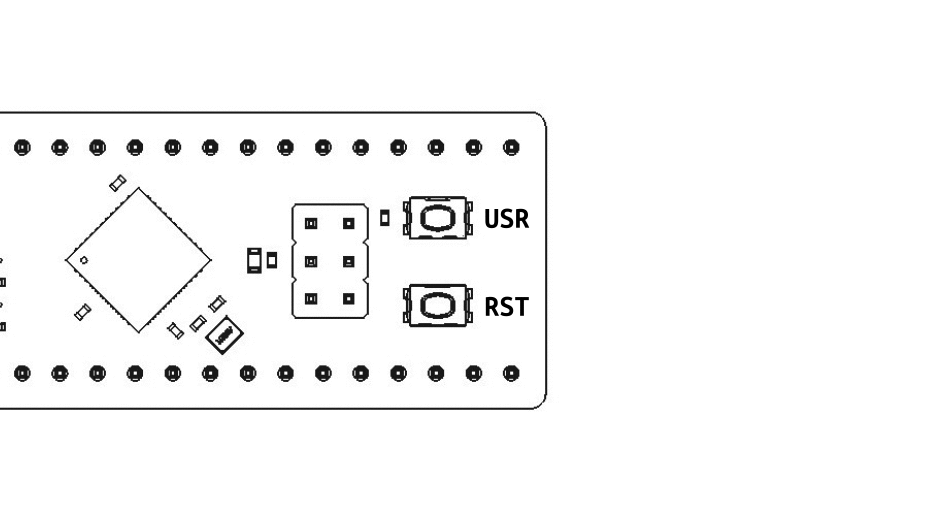

We will be using a few different pieces of software to create our animation - All of which are fully open source and free to use:
- KiCAD
- FreeCAD
- Inkscape
- ImageMagick

### KiCAD 3D PCB Export
To get started we want a simple but accuracte depiction of the product that the user is intended to interact with. In our example the user interacts with push-buttons on an exposed PCB. To make
things a bit less distracting and clean looking, we are going to take the ```.STEP``` output from KiCAD and import the model into FreeCAD allowing us to re-color all of the 3D bodies to a
simple white.

Start by opening your KiCAD PCB file in the PCB editor. Next go to ```File -> Export -> STEP```. Here we want to ensure ```Substitue similarly named models``` checkbox is selected before exporting.
Once checked, press ```Export``` at the bottom.

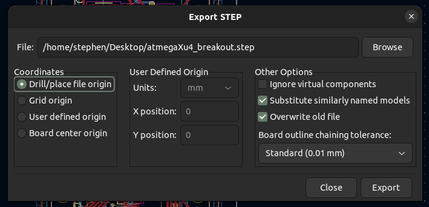

### FreeCAD Import
With the 3D .STEP file exported we are ready to import it into the FOSS MCAD software, FreeCAD. Once imported we can recolor the 3d bodies to a white, giving us a clean and simple depiction of
the PCB. With FreeCAD open, navigate to ```File -> New``` to open a blank document.

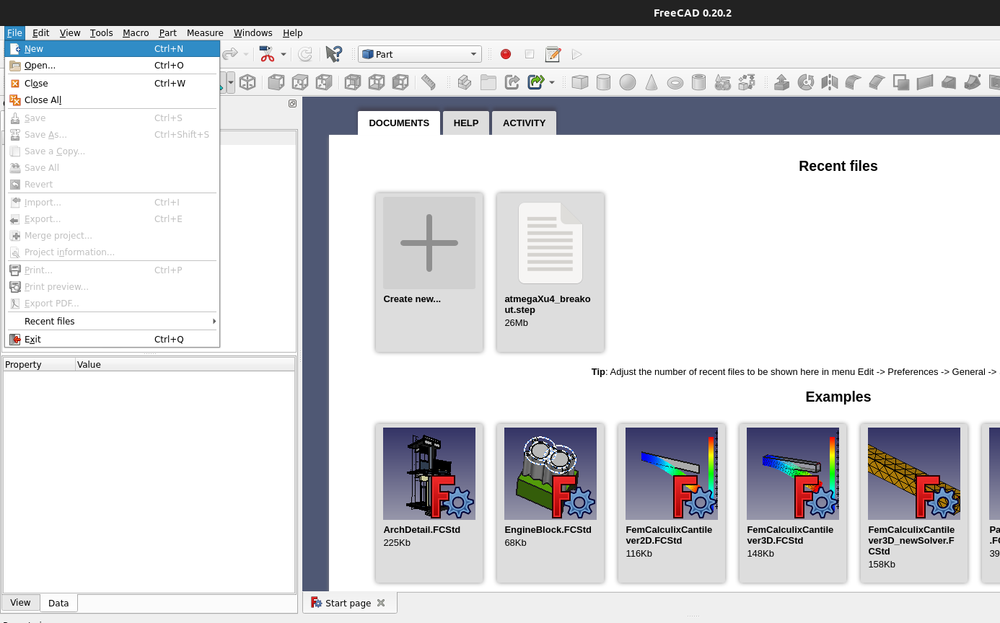

Next we want to open the ```Parts``` workbench. To do so navigate to ```View -> Workbench -> Part```

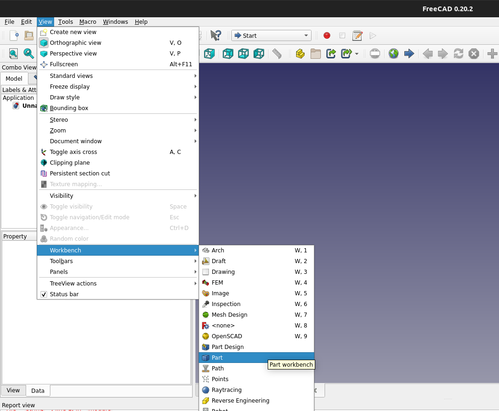

With the Part Workbench view selected we can now import our .STEP file we exported from KiCAD. Navigate to ```Part -> Import CAD``` and select your 3D .step file.

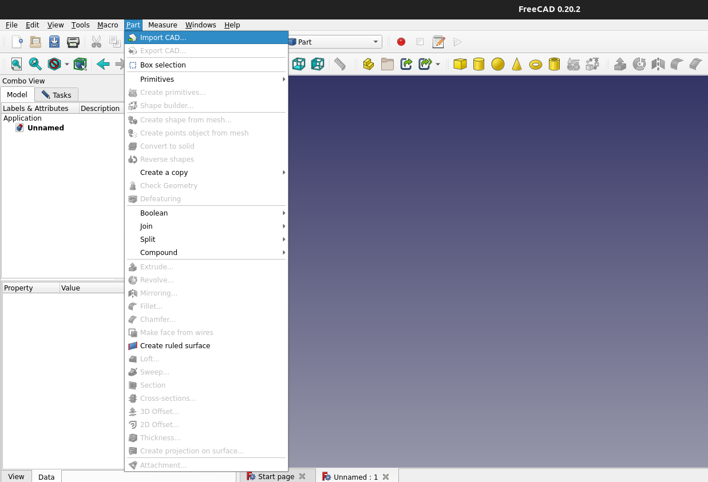

In the project viewer on the left side of the screen you should see a long list of Solids with the name of your 3D step and a number after it - ```e.g - atmegaXu4_breakout001```. We want
to select the first item in the list - there should be no number after the solid name. Rick click and select the ```Set colors...``` option.

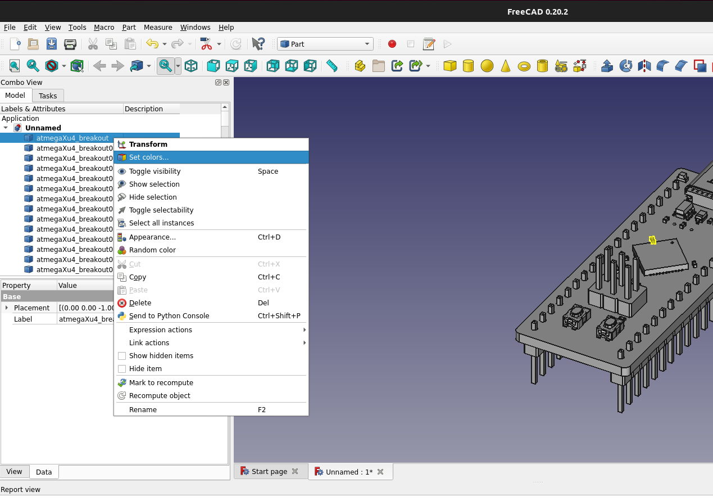

In the ```Display properies``` pane that appears we want to keep the viewing mode as ```Flat Lines``` to give us a "simple" view of the PCB. Before editing the ```Shape color``` press <kbd>SHIFT + B</kbd> to enable the group select tool. Drag and
select the entire PCB model. Now when you update the ```Shape Color``` option, the entire PCB and components will update.
:::note
When setting the shape color to be white it will still appear to be Gray in isometric views. Select an orthographic view to see it as white (e.g. Top, Bottom, Left, Right)
:::

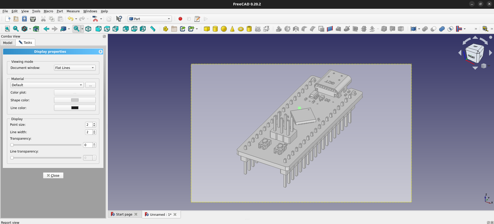

The last thing to update before taking our picture is to set the background. The default background for FreeCAD is a color gradient and we want ours to be a solid white. To update the background
color go to ```Edit -> Preferences -> Display (on the left) -> Colors (tab)```. Here you can set the ```Background color``` to be a ```Simple color``` and use the color picker to set it to white.

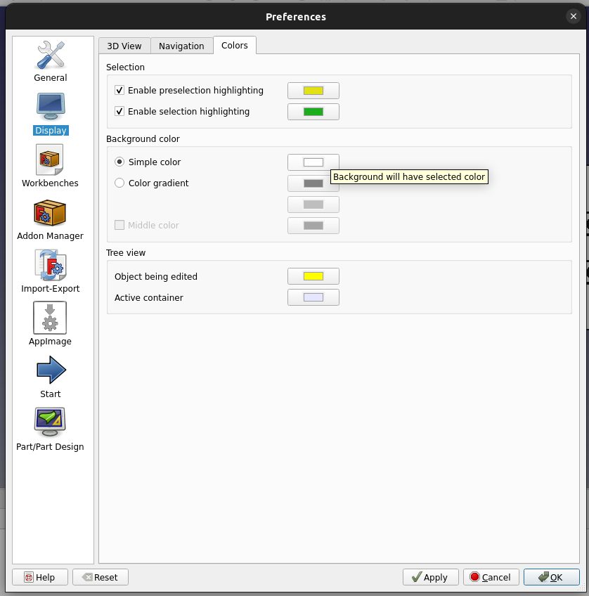

Once you've set the background color, set the 3D view to the isometric or orthograpic view you want and take a picture. FreeCAD has a toolbar option to capture the current 3D viewing area by going
to ```Tools -> Save picture...```

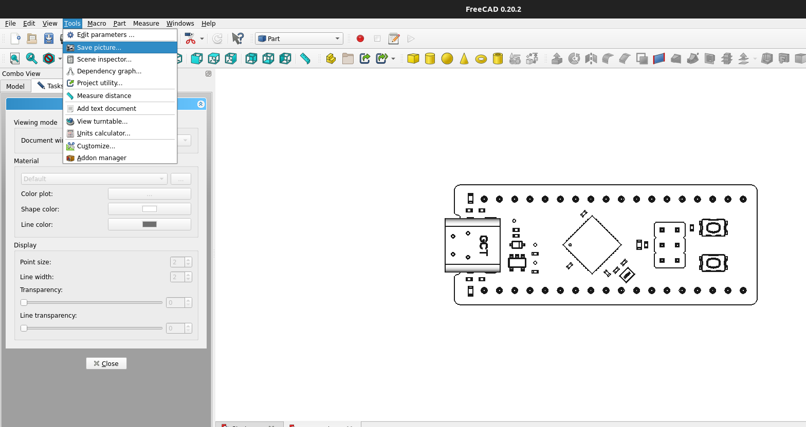

With our picture of a simplified PCB we are ready to create our gif frames.

### Creating frames in Inkscape
We can now go about making the individual frames for our animation. To begin, import our picture we just captured from FreeCAD by pressing <kbd>CTRL + I</kbd>. Select your desired import
properties and press ```OK```. We need an individual photo for each frame and the first frame will likely be a photo of the board with no instruction. To begin the export process and setting
the final frame/animation size press <kbd>SHIFT + CTRL + E</kbd>. Here you can adjust your frame size to be standard, custom or fit to your image. Once you have the frame set as you'd like export
the PNG to a folder to hold all of our frames and name the file ```1```.

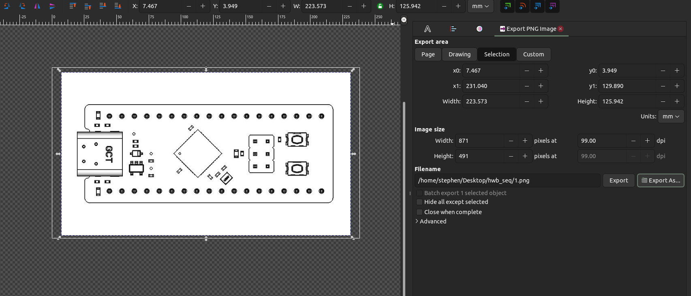

The next steps are going to be specific to your animation. In our example, we want to indicate a sequence of button presses. To do so, we are going to import another image of a finger pointing
to the button to be pressed. In the example, we want the bottom button to be pressed and held - so we will first create a frame showing the button being pressed. Once we have the finger placed
where we'd like we will export the image again and name the file ```2```. By now you can probably tell that we will be naming each frame an incremental and ascending number.

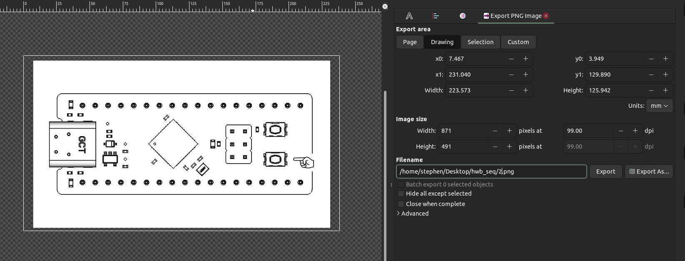

Rinse and repeat the step of adding fingers, lights, etc as needed - exporting each image with an ascending numerical file name until you have completed the capture of your frames. You should end
with a folder full of ```.png``` images numbered ```1``` through ```n```.

### Creating the final .gif animation
We are finally ready combine our frames and create our user interaction animation!

import Tabs from '@theme/Tabs';
import TabItem from '@theme/TabItem';

<Tabs groupId="operating-systems">
  <TabItem value="ubuntu" label="Ubuntu" default>

  On Ubuntu we can use the ImageMagick ```apt``` package to create out gif.
```console
sudo apt install imagemagick
cd DIR_HOLDING_FRAMES
convert -delay 100 -loop 0 *.png user_animation.gif
```

  </TabItem>
  <TabItem value="website" label="ezgif.com" default>

Go to [ezgif.com](https://ezgif.com), upload your images and set the desired delay between each frame

  </TabItem>
</Tabs>

That's it! You should now have a nice .gif to share or include with your documentation, clearly showing how to interact with the product.