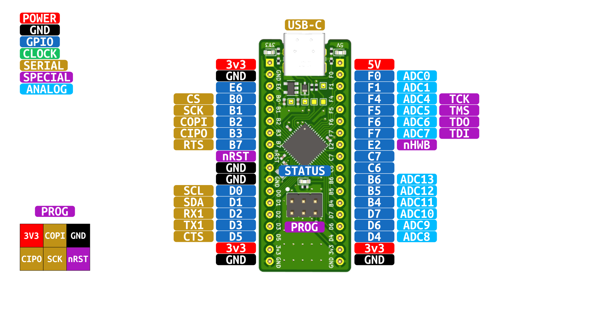

# Pinout
:::info
If you need to debug the board, you want to build your own or just understand the design better - you can find the design files, latest release gerbers, BOM,
schematic and 3d STEP model <a href="https://www.github.com/greatlakesdev/atmega32u4_breakout" target="_blank">on Github</a>.
:::
:::warning
All GPIO and serial peripherals (except USB) operate at 3.3V. Level translators should be used when interfacing with other systems that may run at 1.8V or 5V
:::

The ATmega32u4 microcontroller has all the serial peripherals you would expect from a modern MCU, a full-speed USB connection and a generous number of ADC inputs. The image below shows all of the GPIO port and
pin numbers of the MCU, as well as the commonly used "Alternate functions" of each pin. The following sections below will describe in detail each category of pin funtions.



### Power & GND
The ATmega32u4 breakout board is capable of being powered in two ways:
- The first being to connect a USB type C cable to the USB connector. This supplies 5V to the on board linear voltage regulator which
then provides a 3.3V rail to the microcontroller. When connecting a USB cable 5V is also made availabe on the ```5V``` pin header pin.
- The second method is to provide 5V to the ```5V``` pin. This will then supply the on board regulator which powers the 3v3 power rail. It is OK to use this method at the same time as
plugging in a USB cable. A diode is in place to prevent back-feeding the 5V power rail into the USB connector.

Regardless of which method you choose to power the board, the 3.3V rail will be made available on the ```3v3``` pins.
:::caution
It is not recommended to supply 3.3V to the ```3v3``` pins as it could damage the on board linear voltage regulator.
:::

### GPIO
Every GPIO can be used for reading in or writing out a signal and some also have the ability to trigger interrupts on Rising or Falling edges when configured as an input.
The naming convention is [PORT_LETTER][PIN_NUMBER] - for example ```D5``` is port D, pin 5.

### Status LEDs
The breakout board has three on board status LEDs.
- 5V LED: Indiciates the status of the 5V rail
- 3.3V LED: Indicates the status of the 3.3V rail
- Status LED: General purpose LED that can be used in the user application. This LED is driven via the ```D4``` GPIO.

### Clock
The breakout board has an on-board 16MHz crystal giving a final ```CORE_FREQ``` of 16MHz

### USB
USB Full-Speed capable of synchrounous serial communication at a frequency of 12MHz

### TWI
Two Wire Interface or I2c supports half-duplex serial communication to a max of 128 peripherals on a reduced two wire interface at a max frequency of 400kHz
- ```SCL / D0```: Serial Clock or GPIO ```D0```
- ```SDA / D1```: Serial Data or GPIO ```D1```

### USART
Universal Synchronous and Asynchronous Receiver and Transmitter supports full-duplex serial communication with hardware flow-control support
- ```TX1 / D3```: Transmit line or GPIO ```D3```
- ```RX1 / D2```: Receive line or GPIO ```D2```
- ```CTS / D5```: Flow Control - Clear to Send or GPIO ```D5```
- ```RTS / B7```: Flow Control - Request to Send or GPIO ```B7```

### SPI
Serial Peripheral Interface supports full-duplex serial communication to one or more peripherals at a max frequnecy of ```CORE_CLOCK_FREQ / 2``` MHz
- ```COPI / B2```: Controller Out - Peripheral In or GPIO ```B2```
- ```CIPO / B3```: Controler In - Peripheral Out or GPIO ```B3```
- ```SCK / B1```: Serial Clock or GPIO ```B1```
- ```CS / B0```: Chip Select or GPIO ```B0```

:::note
The ```CS``` pin does not have to be used when utilizing the ```SPI``` peripheral. The user can instead manually actuate a ```GPIO``` pin connected to a peripherals ```CS``` line.
This allows for a larger bus and more peripherals to be connected at once.
:::

### Analog
The breakout board has twelve 10-bit ```ADC```, or Analog to Digital Converter, pins. Each capable of reading in voltage ranges from 0 to 3.3V giving a reading accuracy down to ~3mV.
- ```ADC0 / F0```: Analog input 0 or GPIO ```F0```
- ```ADC1 / F1```: Analog input 1 or GPIO ```F1```
- ```ADC4 / F4```: Analog input 4 or GPIO ```F4```
- ```ADC5 / F5```: Analog input 5 or GPIO ```F5```
- ```ADC6 / F6```: Analog input 6 or GPIO ```F6```
- ```ADC7 / F7```: Analog input 7 or GPIO ```F7```
- ```ADC8 / D4```: Analog input 8 or GPIO ```D4```
- ```ADC9 / D6```: Analog input 9 or GPIO ```D6```
- ```ADC10 / D7```: Analog input 10 or GPIO ```D7```
- ```ADC11 / B4```: Analog input 11 or GPIO ```B4```
- ```ADC12 / B5```: Analog input 12 or GPIO ```B5```
- ```ADC13 / B6```: Analog input 13 or GPIO ```B6```

### Special and Programming
The special pins are generally used for programming the device via JTAG or USB DFU and are as follows
- ```nRST```: Active Low chip reset
- ```nHWB```: Active Low hardware boot. Used in conjuction with ```nRST``` to jump to the built-in bootloader
- ```TCK```: JTAG Clock
- ```TMS```: JTAG Test Mode Select
- ```TDO```: JTAG Test Data Out
- ```TDI```: JTAG Test Data In

#### AVR-SPI ```PROG``` header
A dedicated programming header is available on the breakout board which matches the AVR-SPI standard programming pinout. These SPI pins are the same signals
found down the left side of the board on GPIOs ```B1``` - ```B3```