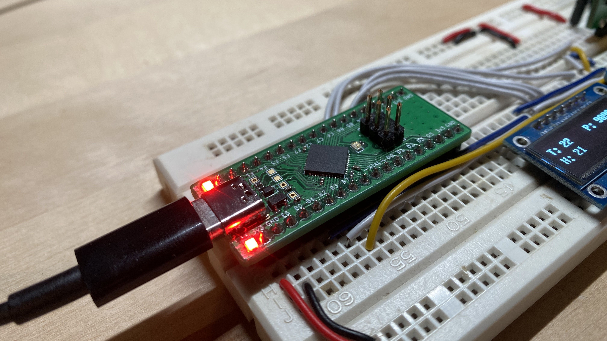

The ATmega32u4 breakout board makes it easy to get up and going with an AVR Microcontroller and utilize IO features such as ADCs, SPI, TWI, and UART as well as a Full-Speed USB interface.
Standard pitch spacing on the headers allow it to be inserted into a breadboard and used for prototyping or through-hole soldered down onto a larger project/carrier board. A summary of the breakout board IO
is as follows:
- 26x GPIO (Several of the GPIO have an alternate function shared with the peripherals described below)
- 12x 10-bit ADC inputs
- 1x USART
- 1x TWI (i2c)
- 1x SPI
- 1x Status LED
- 1x 5V Power LED
- 1x 3.3V Power LED
- 1x AVR-SPI Programming header
- 1x USB Full-Speed interface via USB Type C connector

You can choose a couple different paths when writing applications for this board (bare-metal or Arduino), as well as multiple options for programming the board (AVR-SPI, JTAG or USB DFU).
We have guides for it all here in the docs!

:::info
If you need to debug the board, you want to build your own or just understand the design better - you can find the design files, latest release gerbers, BOM,
schematic and 3d STEP model <a href="https://www.github.com/greatlakesdev/atmega32u4_breakout" target="_blank">on Github</a>.
:::