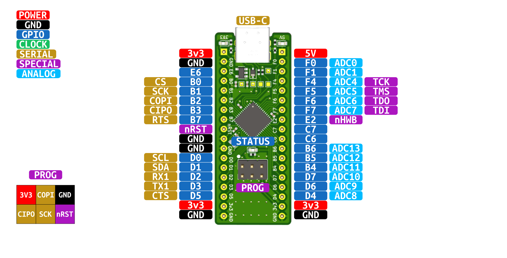

# atmega32u4 breakout


## Introduction
The ATmega32u4 breakout board makes it easy to get up and going with an AVR Microcontroller and utilize IO features such as ADCs, SPI, TWI, and UART as well as a Full-Speed USB interface.
Standard pitch spacing on the headers allow it to be inserted into a breadboard and used for prototyping or through-hole soldered down onto a larger project/carrier board. You can choose
a couple different paths when using the dev board. The first being bare-metal where you use the AVR toolchain and tools to compile your application and flash the device. The second
option being to flash the Arduino bootloader, allowing you to write ```.ino``` scripts and upload them via USB. We have guides for both here in the docs!

:::info
If you need to debug the board, you want to build your own or just understand the design better - you can find the design files, latest release gerbers, BOM,
schematic and 3d STEP model <a href="https://www.github.com/greatlakesdev/atmega32u4_breakout" target="_blank">on Github</a>.
:::

## Hardware Overview
The silkscreen labeling on the PCB has the actual AVR port and pin names. The chart below can be used to determine the alternate functions of each pin.


