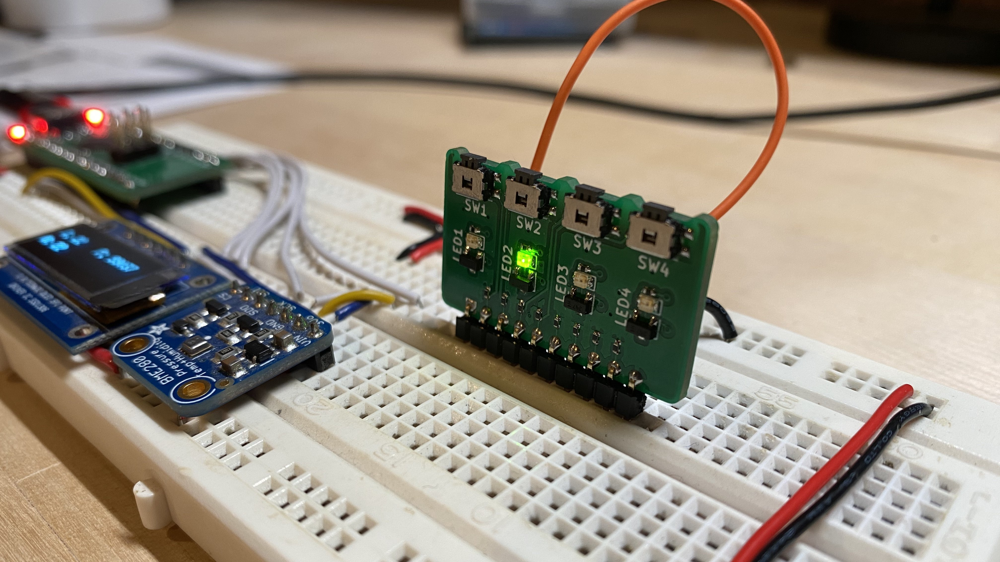

# breadboard-io

## Introduction
breadboard-io makes it easy to connect 4 LEDs and 4 push-buttons to a broadboard in a compact and neat footprint. Provide VCC, GND and your signal wires to other circuitry or microcontroller and you're ready to go. You can find the design files, latest release gerbers, BOM, schematic and 3d STEP model <a href="https://www.github.com/greatlakesdev/breadboard-io" target="_blank">on Github</a>.

## IO Diagram
At a minimum you must provide a voltage power rail (VCC - max 5V), ground (GND), and at least a single signal wire (LEDx or SWx). All signals are active high - meaning when a push-button is pressed, SWx will go from GND to VCC. To turn on LEDx, you would apply a positive signal (VCC) to the pin.

:::caution
The SWx output signals have a 1k ohm padding resistor to protect from any shortages. The SWx signals are fine for direct connection to a microcontroller or other high impedence circuits, but should not be used to directly drive any larger loads like a DC motor. Instead consider using a FET to control your load and then enable the FET gate using the SWx output.
:::

