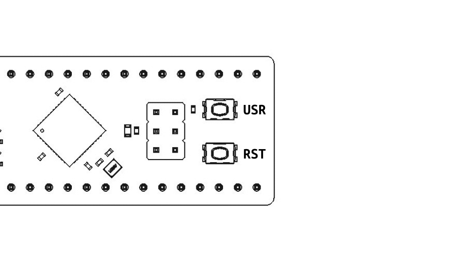

When using the atmega32u4 breakout board in a bare-metal setup we have two options for relfashing: ```avrdude``` and an ISP programmer or ```USB-DFU```
with a single USB Type C cable. Using the ISP programmer can be easiest when at a bench and you're actively developing your application and constantly reflashing to test. The
USB-DFU programmer is by far more convenient when your on the go or need to flash an updated application to a finished and installed project. A single USB to
provide power plus data and you can flash your application.

:::note
The default variant (```bare-metal```) of the atmega32u4_breakout comes pre-loaded with the USB-DFU programmer. If you have a board set up to use the Arduino environment
or accidentally mass-erased the chip and deleted the USB-DFU bootloader then checkout [this guide](flashing-dfu-bootloader) to reflash it.
:::

<br/>

A simple two-button sequence is needed to enter the USB-DFU bootloader:
- Begin by pressing and holding the ```RST``` button
- Next press and hold the ```USR``` button
- Release the ```RST``` button
- Release the ```USR``` button

Once completing the sequence outlined above and shown below, the USB DFU bootloader should enumerate on your PC. You can now use the ```make dfu_flash``` and ```make dfu_erase```
commands in the [avr-cmake-template](/docs/avr-cmake-template#flashing) or reflash the board using [```dfu-programmer```](https://github.com/dfu-programmer/dfu-programmer) directly
