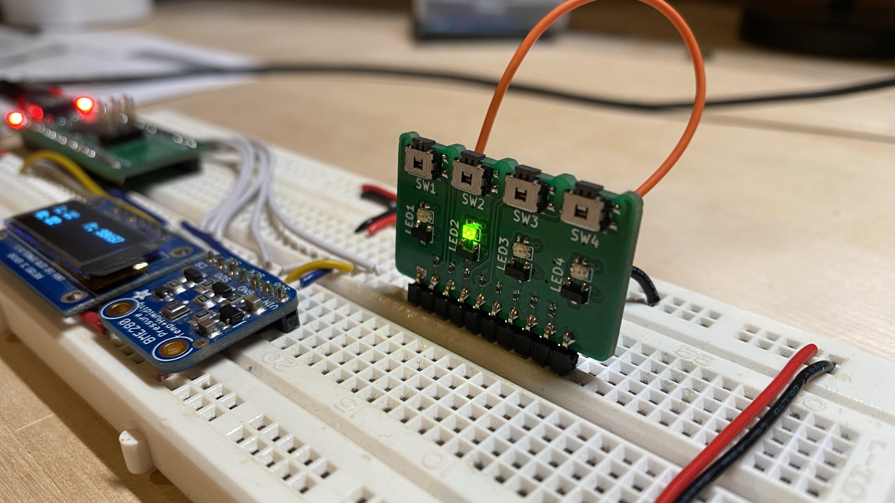
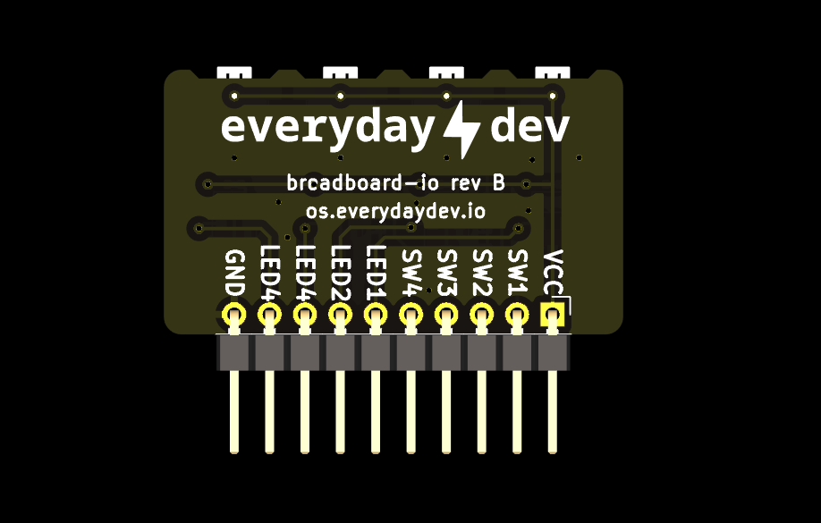

## Introduction
breadboard-io makes it easy to connect 4 LEDs and 4 push-buttons to a breadboard in a compact and neat footprint. Provide VCC, GND and your signal wires to other circuitry or microcontroller and you're ready to go!

:::info
If you need to debug the board, you want to build your own or just understand the design better - you can find the design files, latest release gerbers, BOM,
schematic and 3d STEP model <a href="https://www.github.com/greatlakesdev/breadboard-io" target="_blank">on Github</a>.
:::

## Hardware Overview
breadboard-io provides the user access to the following via a single 2.54" pitch pin header:
- 4x ```Active High``` push-buttons (labeled ```SWx```)
- 4x ```Active High``` LEDs (labeled ```LEDx```)
- 1x ```VCC``` pin to apply power to the board
- 1x ```GND``` pin for grounding the board

:::info
```Active High``` means that the "thing" will turn on, or is active, when VCC is present - aka the signal is "High". Thus ```Active High```.
:::


To use breadboard-io you must at a minimum provide a voltage power rail to the ```VCC``` pin, a ground connection at the ```GND``` pin and connect at least a single signal wire (```LEDx``` or ```SWx```).

:::note
The SWx output signals have a 10k ohm padding resistor to protect from any shortages between the VCC rail and GND. The SWx signals are fine for direct connection to a microcontroller or other high impedence circuits
but should not be used to directly drive any larger loads like a DC motor as you'll have trouble getting the current needed. Instead consider using a FET to control your load and then enable the FET gate using the SWx output.
:::

