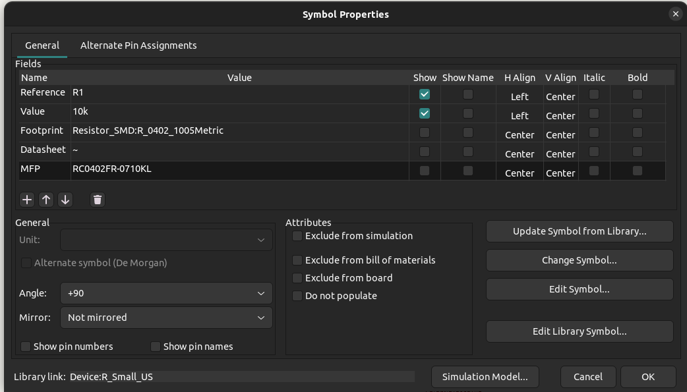

## Introduction
The KiCAD project template is great for getting up and going quickly on your KiCAD PCB projects! The default board stackup follows the PCBWay standard stackup and
the design rules are setup to be the smallest and most accomodating without going into the "Advanced" process thus greatly increasing the price of board fabrication.
This template also has the necessary scripts and workflow files for automated releases (CI/CD) on Github making the release process easier and quicker for you.

:::info
The template can be found on Github in the [kicad-project-template](https://github.com/greatlakesdev/kicad-project-template) repository
:::

## Setup
To make the template your own you will need to update the name of a few files as well as edit schematic sheet settings. The first step is to update file names. Inside the template
is a folder called ```kicad-project-template```. Update the name to be your desired project name (e.g. EX_PROJECT). Next you need to update the ```.kicad_pro```, ```.kicad_sch``` and ```.kicad_pcb```
files found inside the project folder we just renamed. Rename all three files to be the same as the folder name (e.g. ```EX_PROJECT.kicad_pro```). With all of these file names updated you should
now be able to open the project in KiCAD and see both the Schematic and PCB Documents.


Next we need to update Schematic sheet settings. Several variables are already set such as a company name, license type, revision etc.
These settings are updated by opening the ```EX_PROJECT.kicad_sch``` file and then navigating to ```File > Page Settings```. These same steps should be repeated for the PCB doc as well (.kicad_pcb).


With the files renamed and all page settings udpated, you are ready to start designing your PCB!

## Bill of Materials
There are multiple ways and scripts that can be used to generate a Bill of Materials in KiCAD. A ```util/``` folder is included in the template with a useful starting point for creating your BOM.
Inside is a ```bom_csv_grouped_by_mfp.py``` script which generates a comma separated BOM with the line items grouped by the MFP (Manufacturer Part Number) field.
To load and use this script, open the PCB file and go to ```Tools > Generate BOM...```. From here there will be a couple scripts already loaded and you are welcome to use those if they meet your needs.
To use the templates util script, click the ```+``` in the bottom left of the script pane to load a new BOM Generator. Navigate to the ```util/``` folder and select the ```bom_csv_grouped_by_mfp.py``` script.
You can give the script whatever nickname you would like and once completed, press Generate in the bottom-right of the window. You should now have a file called ```EX_PROJECT.csv``` inside the
```EX_PROJECT/``` folder - that's your BOM! The key thing to note is that this script groups the components by the MFP field. This is not a default field in KiCAD and must be manually added to the
component. It can be tedious at first but greatly improves the usability of the final BOM. The MFP field can be added to any part by selecting in the schematic, pressing <kbd>E</kbd>, and then adding
the ```MFP``` field with the part number as the value.



## 3D Models
In some cases you will use a component that does not have a 3D model built-in to KiCAD. You can place these ```.step``` or ```.wrl``` files in the ```models/``` folder.
To reference them you can use the KiCAD Project variable (```KIPROJMOD```) to set a relative path to these models when updating the pcb component properties by selecting in the PCB doc,
pressing <kbd>E</kbd>, and then adding a new file path for your model. Ex. ```${KIPRJMOD}/../models/EXAMPLE_MODEL.step```


## Github Releases
The template has a preloaded workflow for use with Github runners which allows a consistent and hands-free release process. The integration is triggered in two ways. Either manually kicking off
the action from the Github Web UI (this is default behavior) or it's triggered on pushes to the ```main``` branch. Both options are explained in further detail below. The release will be tagged and named whatever
is set as the ```Revision``` in the ```EX_PROEJCT.kicad_sch``` page settings. When making releases you MUST change/increment the ````Revision```` value or delete any old releases/tags that might have the same name,
otherwise the workflow will fail.

### Configuration
The workflow is configured by editing the ```ci.yml``` file located in ```.github/workflows/```. At a minimum we need to update the project name env variable to match the folder and file renaming
we did previously (```EX_PROJECT```).
```yml
env:
  PROJECT_NAME: "EX_PROJECT"
```

Lastly we need to configure the CLI tool. As of KiCAD v7 the the ```kicad-cli``` utility was added allowing the generation of KiCAD build outputs from the command line.
```yml
CLI_TOOL: "kicad-cli"
```

:::warning
As of writing these docs, the CLI support for KiCAD has not made it to a stable release and we must use the ```kicad-cli-nightly``` binary and install. Once KiCAD v7 has made it
public the ```CLI_TOOL``` env variable can be updated to ```kicad-cli``` and the KiCAD install steps can be changed to install the stable release.
```yml
env:
  CLI_TOOL: "kicad-cli-nightly"
```
```yml
# To be updated once kicad-cli makes it to stable release in v7
- name: Install KiCAD
    run: |
    sudo add-apt-repository --yes ppa:kicad/kicad-dev-nightly
    sudo apt update
    sudo apt install kicad-nightly
```

:::

### Manual Release
The default setup of the workflow is for manually triggering of a release. The configuration at the top of the ```.github/workflows/ci.yml``` is set to workflow_displatch to enable this feature.
```yml
on:
  # Enable workflow only when manually called
  workflow_dispatch
  # OR
  # Enable workflow on pushes to main and dev
  # push:
    # branches: [ main, dev ]
```

### Release on Push
The second option for Github releases is to create a new relase on ```push``` to main. Meaning any commit on the ```main``` branch will create a new release. If you intend to use the ```on push```
method and want to make multiple incremental changes/pushes to your design it's recommended you work out of a ```dev``` branch and then PR the changes into ```main``` when you are ready to make a release.
To enable the 'Release on Push' functionality we need to edit the ```ci.yml``` and uncomment the ```push``` and ```branches``` lines. Comment out the ```workflow_dispatch``` line.
```yml
on:
  # Enable workflow only when manually called
  #workflow_dispatch
  # OR
  # Enable workflow on pushes to main and dev
  push:
    branches: [ main, dev ]
```